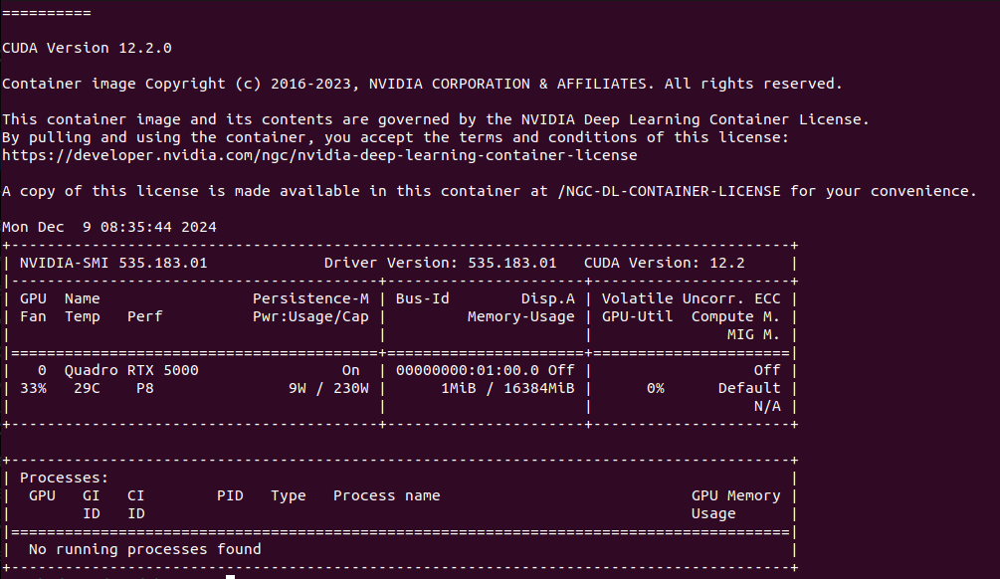

# CCU - Deeplabcut docker images - Installation tutorial for Linux

In order to use these scripts to install DLC3.xx, please follow the steps below:


## Be sure you have these packages installed:

- Docker
- nvidia-drivers
- nvidia-cuda-tookit
- nvidia-container-toolkit
- wget

In order to test if everything is working as expected, type the following command in a terminal:

```
docker run --gpus all nvidia/cuda:12.2.0-runtime-ubuntu22.04 nvidia-smi`
```

You should then see an output similar to this:



### Copy all files contained here to a folder, and from that folder issue the following commands:
```
wget https://developer.download.nvidia.com/compute/cuda/12.6.2/local_installers/cuda-repo-debian12-12-6-local_12.6.2-560.35.03-1_amd64.deb 

docker build -f Dockerfile_DLC3.1 -t dlc3 .
```

### To manually, activate your docker container and execute into it by using:

```
docker run --gpus all -d -p 10000:10000 --name dlc3_xpra dlc3

docker exec -it dlc3_xpra /bin/sh
```

#### Once inside, you can run the script by using:

``` sh Execute.sh ```

#### And then in your browser you can open a new url:

```localhost:10000 ```

#### And you should be able to access the visual interface of DLC.


